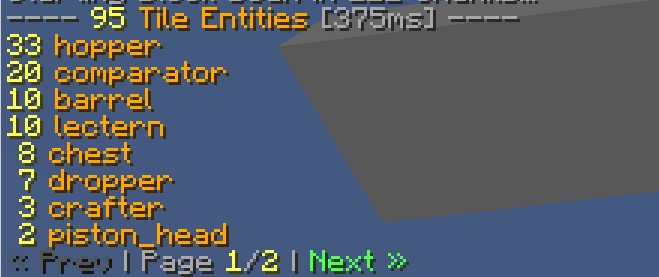

# WorldEdit Entity Scanner
A fast, async-safe tool to count **entities** and **tile entities** inside a WorldEdit selection, or
within a **specified range** of another user.

## Features
- Runs asynchronously to avoid server lag
- Count entities and tile entities separately or together
- Zero TPS impact, even for multi-million block selections
- Live progress feedback for large scans

## Commands
| Command              | Description                                   |
|----------------------|-----------------------------------------------|
| `//scanentities`     | Scans for entities in the defined range.      |
| `//scantileentities` | Scans for tile entities in the defined range. |
| `//scanall`          | Scans for both entities and tile entities.    |
| `//scanstop`         | Cancels an ongoing scan.                      |

### Parameters
| Parameter    | Description                                                             | Default               |
|--------------|-------------------------------------------------------------------------|-----------------------|
| `filter=...` | Types to filter by, separated by comma (e.g. `filter=dropper,furnace`). | All types             |
| `user=...`   | Scans around a specified user instead of your own WorldEdit selection.  | Your active selection |
| `radius=...` | Radius around the user to scan.                                         | 10                    |

## Permissions:
| Permission Node              | Description            | Default |
|------------------------------|------------------------|---------|
| `worldeditentityscanner.use` | Use commands           | op      |

## Requirements
- Paper 1.21.*
- [FastAsyncWorldEdit](https://www.spigotmc.org/resources/fastasyncworldedit.13932/)
